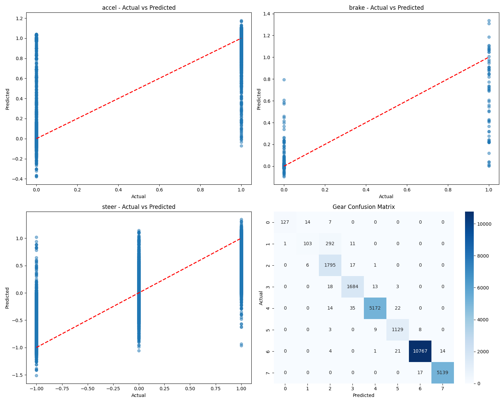

# Model Evaluation Report

Generated on: 2025-06-13 16:45:34

## Feature Weights

| Feature | Weight |
|---------|--------|
| trackPos | 2.0 |
| opponent_0 | 0.0 |
| opponent_1 | 0.0 |
| opponent_2 | 0.0 |
| opponent_3 | 0.0 |
| opponent_4 | 0.0 |
| opponent_5 | 0.0 |
| opponent_6 | 0.0 |
| opponent_7 | 0.0 |
| opponent_8 | 0.0 |
| opponent_9 | 0.0 |
| opponent_10 | 0.0 |
| opponent_11 | 0.0 |
| opponent_12 | 0.0 |
| opponent_13 | 0.0 |
| opponent_14 | 0.0 |
| opponent_15 | 0.0 |
| opponent_16 | 0.0 |
| opponent_17 | 0.0 |
| opponent_18 | 0.0 |
| opponent_19 | 0.0 |
| opponent_20 | 0.0 |
| opponent_21 | 0.0 |
| opponent_22 | 0.0 |
| opponent_23 | 0.0 |
| opponent_24 | 0.0 |
| opponent_25 | 0.0 |
| opponent_26 | 0.0 |
| opponent_27 | 0.0 |
| opponent_28 | 0.0 |
| opponent_29 | 0.0 |
| opponent_30 | 0.0 |
| opponent_31 | 0.0 |
| opponent_32 | 0.0 |
| opponent_33 | 0.0 |
| opponent_34 | 0.0 |
| opponent_35 | 0.0 |

## Model Architecture

| Parameter | Value |
|-----------|-------|
| hidden_layer_sizes | (180, 180, 60, 30) |
| activation | relu |
| solver | adam |
| max_iter | 100 |
| n_layers | 6 |
| n_features | 73 |
| n_outputs | 5 |
| n_iterations | 100 |
| loss | 0.007828681734812586 |
| best_loss | 0.007828681734812586 |

## Dataset Information

Number of test samples: 26447

## Regression Metrics

### accel

| Metric | Value |
|--------|-------|
| MAE | 0.0326 |
| RMSE | 0.1184 |
| R2 | 0.7732 |
| Mean Actual | 0.9338 |
| Mean Predicted | 0.9379 |
| Std Actual | 0.2486 |
| Std Predicted | 0.2224 |
| Min Actual | 0.0000 |
| Max Actual | 1.0000 |
| Min Predicted | -0.3786 |
| Max Predicted | 1.1781 |

### brake

| Metric | Value |
|--------|-------|
| MAE | 0.0081 |
| RMSE | 0.0285 |
| R2 | 0.6633 |
| Mean Actual | 0.0024 |
| Mean Predicted | -0.0041 |
| Std Actual | 0.0491 |
| Std Predicted | 0.0388 |
| Min Actual | 0.0000 |
| Max Actual | 1.0000 |
| Min Predicted | -0.0960 |
| Max Predicted | 1.3384 |

### steer

| Metric | Value |
|--------|-------|
| MAE | 0.1593 |
| RMSE | 0.2805 |
| R2 | 0.6699 |
| Mean Actual | 0.0607 |
| Mean Predicted | 0.0737 |
| Std Actual | 0.4882 |
| Std Predicted | 0.3942 |
| Min Actual | -1.0000 |
| Max Actual | 1.0000 |
| Min Predicted | -1.5150 |
| Max Predicted | 1.3456 |

### gear

| Metric | Value |
|--------|-------|
| Accuracy | 0.9799 |
| F1 | 0.9772 |
| Most Common Gear Predicted | 5.0000 |

### safety

| Metric | Value |
|--------|-------|
| Percentage Invalid Accel | 34.5294 |
| Percentage Invalid Brake | 93.5002 |
| Percentage Invalid Steer | 4.4428 |

## Gear Classification Metrics

| Metric | Value |
|--------|-------|
| Accuracy | 0.9799 |
| F1 | 0.9772 |
| Most Common Gear Predicted | 5.0000 |

### Gear Distribution

| Gear | Actual Count | Predicted Count |
|------|--------------|-----------------|
| -1 | 148 | 128 |
| 0 | 407 | 123 |
| 1 | 1819 | 2133 |
| 2 | 1718 | 1747 |
| 3 | 5243 | 5196 |
| 4 | 1149 | 1175 |
| 5 | 10807 | 10792 |
| 6 | 5156 | 5153 |

## Safety Checks

| Check | Count | Percentage |
|-------|-------|------------|
| Invalid Accel | 9132 | 34.53% |
| Invalid Brake | 24728 | 93.50% |
| Invalid Steer | 1175 | 4.44% |

## Prediction Plots

