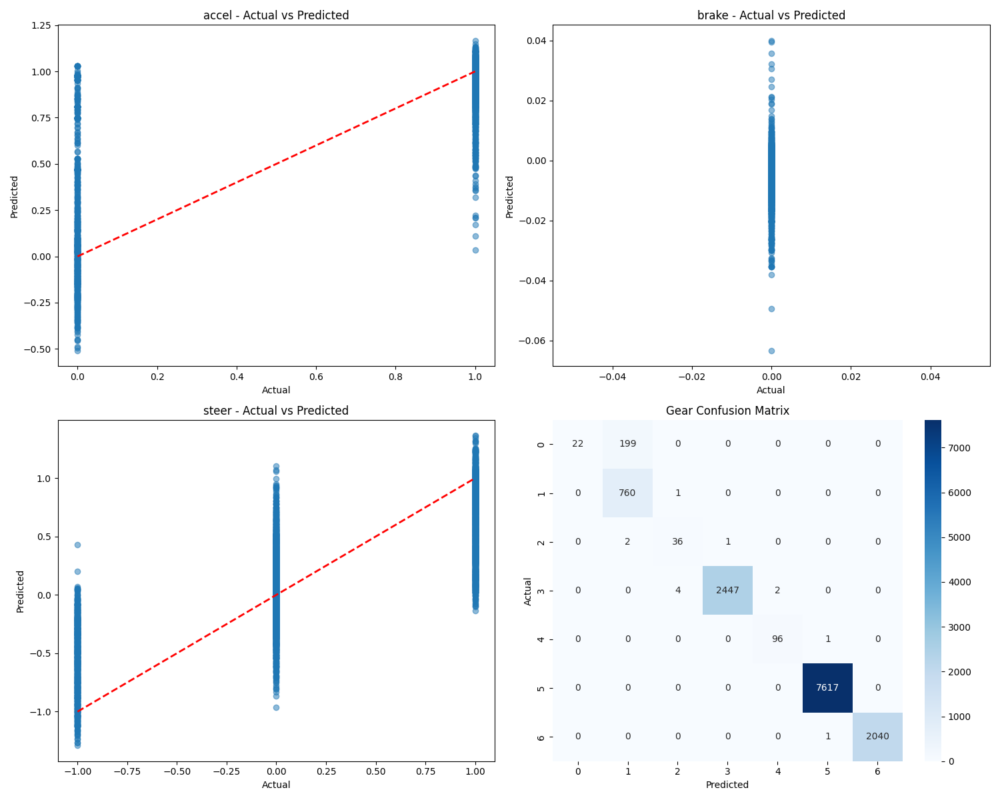

# Model Evaluation Report (Baby Hamza V1)

Generated on: 2025-05-05 14:19:11

## Model Architecture

| Parameter | Value |
|-----------|-------|
| hidden_layer_sizes | (100, 50, 25) |
| activation | relu |
| solver | adam |
| max_iter | 1000 |
| n_layers | 5 |
| n_features | 73 |
| n_outputs | 5 |
| n_iterations | 57 |
| loss | 0.0077445246338944 |
| best_loss | 0.0077445246338944 |

## Dataset Information

Number of test samples: 13229

## Regression Metrics

### accel

| Metric | Value |
|--------|-------|
| MAE | 0.0468 |
| RMSE | 0.1240 |
| R2 | 0.7165 |
| Mean Actual | 0.9424 |
| Mean Predicted | 0.9361 |
| Std Actual | 0.2330 |
| Std Predicted | 0.2098 |
| Min Actual | 0.0000 |
| Max Actual | 1.0000 |
| Min Predicted | -0.5094 |
| Max Predicted | 1.1676 |

### brake

| Metric | Value |
|--------|-------|
| MAE | 0.0032 |
| RMSE | 0.0045 |
| R2 | 0.0000 |
| Mean Actual | 0.0000 |
| Mean Predicted | -0.0028 |
| Std Actual | 0.0000 |
| Std Predicted | 0.0036 |
| Min Predicted | -0.0634 |
| Max Predicted | 0.0400 |

### steer

| Metric | Value |
|--------|-------|
| MAE | 0.1527 |
| RMSE | 0.2523 |
| R2 | 0.6182 |
| Mean Actual | 0.0618 |
| Mean Predicted | 0.0548 |
| Std Actual | 0.4083 |
| Std Predicted | 0.3212 |
| Min Actual | -1.0000 |
| Max Actual | 1.0000 |
| Min Predicted | -1.2915 |
| Max Predicted | 1.3664 |

### gear

| Metric | Value |
|--------|-------|
| Accuracy | 0.9841 |
| F1 | 0.9788 |
| Most Common Gear Predicted | 5.0000 |

### safety

| Metric | Value |
|--------|-------|
| Percentage Invalid Accel | 25.3987 |
| Percentage Invalid Brake | 89.9614 |
| Percentage Invalid Steer | 2.4870 |

## Gear Classification Metrics

| Metric | Value |
|--------|-------|
| Accuracy | 0.9841 |
| F1 | 0.9788 |
| Most Common Gear Predicted | 5.0000 |

### Gear Distribution

| Gear | Actual Count | Predicted Count |
|------|--------------|-----------------|
| 0 | 221 | 22 |
| 1 | 761 | 961 |
| 2 | 39 | 41 |
| 3 | 2453 | 2448 |
| 4 | 97 | 98 |
| 5 | 7617 | 7619 |
| 6 | 2041 | 2040 |

## Safety Checks

| Check | Count | Percentage |
|-------|-------|------------|
| Invalid Accel | 3360 | 25.40% |
| Invalid Brake | 11901 | 89.96% |
| Invalid Steer | 329 | 2.49% |

## Prediction Plots

