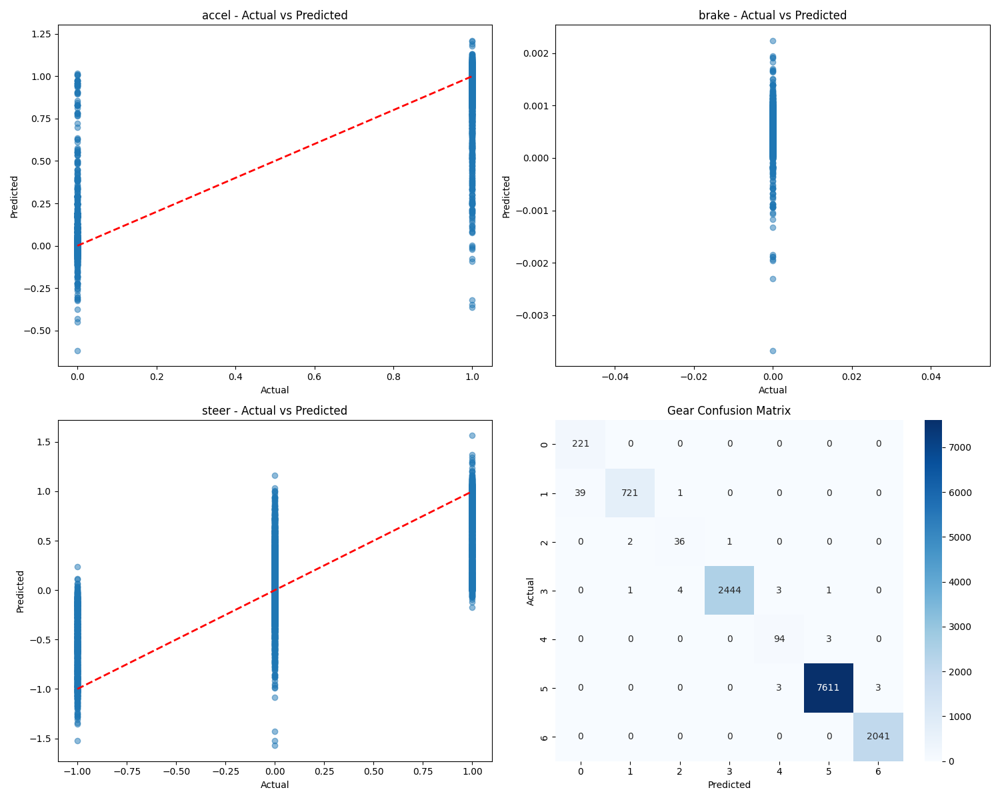

# Model Evaluation Report

Generated on: 2025-05-07 13:23:10

## Parameter Modifications
Allowed the model to utilise data from parked state.

## Model Architecture

| Parameter | Value |
|-----------|-------|
| hidden_layer_sizes | (100, 50, 25) |
| activation | relu |
| solver | adam |
| max_iter | 1000 |
| n_layers | 5 |
| n_features | 73 |
| n_outputs | 5 |
| n_iterations | 92 |
| loss | 0.007649699085725936 |
| best_loss | 0.007642647709289031 |

## Dataset Information

Number of test samples: 13229

Used HS_Wins dataset.

## Regression Metrics

### accel

| Metric | Value |
|--------|-------|
| MAE | 0.0364 |
| RMSE | 0.1004 |
| R2 | 0.8143 |
| Mean Actual | 0.9424 |
| Mean Predicted | 0.9384 |
| Std Actual | 0.2330 |
| Std Predicted | 0.2251 |
| Min Actual | 0.0000 |
| Max Actual | 1.0000 |
| Min Predicted | -0.6187 |
| Max Predicted | 1.2111 |

### brake

| Metric | Value |
|--------|-------|
| MAE | 0.0006 |
| RMSE | 0.0006 |
| R2 | 0.0000 |
| Mean Actual | 0.0000 |
| Mean Predicted | 0.0006 |
| Std Actual | 0.0000 |
| Std Predicted | 0.0002 |
| Min Predicted | -0.0037 |
| Max Predicted | 0.0022 |

### steer

| Metric | Value |
|--------|-------|
| MAE | 0.1475 |
| RMSE | 0.2632 |
| R2 | 0.5844 |
| Mean Actual | 0.0618 |
| Mean Predicted | 0.0484 |
| Std Actual | 0.4083 |
| Std Predicted | 0.3157 |
| Min Actual | -1.0000 |
| Max Actual | 1.0000 |
| Min Predicted | -1.5737 |
| Max Predicted | 1.5660 |

### gear

| Metric | Value |
|--------|-------|
| Accuracy | 0.9954 |
| F1 | 0.9955 |
| Most Common Gear Predicted | 5.0000 |

### safety

| Metric | Value |
|--------|-------|
| Percentage Invalid Accel | 50.5329 |
| Percentage Invalid Brake | 0.5669 |
| Percentage Invalid Steer | 1.9578 |

## Gear Classification Metrics

| Metric | Value |
|--------|-------|
| Accuracy | 0.9954 |
| F1 | 0.9955 |
| Most Common Gear Predicted | 5.0000 |

### Gear Distribution

| Gear | Actual Count | Predicted Count |
|------|--------------|-----------------|
| 0 | 221 | 260 |
| 1 | 761 | 724 |
| 2 | 39 | 41 |
| 3 | 2453 | 2445 |
| 4 | 97 | 100 |
| 5 | 7617 | 7615 |
| 6 | 2041 | 2044 |

## Safety Checks

| Check | Count | Percentage |
|-------|-------|------------|
| Invalid Accel | 6685 | 50.53% |
| Invalid Brake | 75 | 0.57% |
| Invalid Steer | 259 | 1.96% |

## Prediction Plots

## Real World Performance
Runs in Gear 1 always.
Remarkable ability to recover from crash and get back on track. Avoids cars really well.