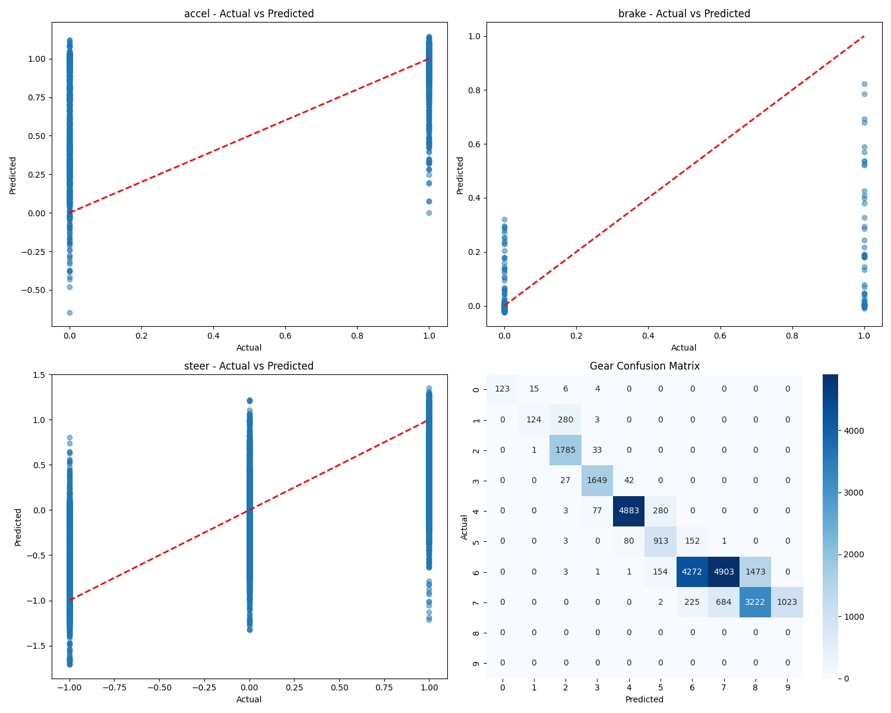

# Model Evaluation Report

Generated on: 2025-06-13 16:52:23

## Feature Weights

| Feature | Weight |
|---------|--------|
| trackPos | 3.0 |
| speedX | 1.3 |
| distFromStart | 0.8 |
| z | 0.7 |

## Model Architecture

| Parameter | Value |
|-----------|-------|
| hidden_layer_sizes | (180, 180, 60, 30) |
| activation | relu |
| solver | adam |
| max_iter | 100 |
| n_layers | 6 |
| n_features | 73 |
| n_outputs | 5 |
| n_iterations | 89 |
| loss | 0.007221736166748222 |
| best_loss | 0.007221736166748222 |

## Dataset Information

Number of test samples: 26447

## Regression Metrics

### accel

| Metric | Value |
|--------|-------|
| MAE | 0.0635 |
| RMSE | 0.2050 |
| R2 | 0.3196 |
| Mean Actual | 0.9338 |
| Mean Predicted | 0.9799 |
| Std Actual | 0.2486 |
| Std Predicted | 0.1242 |
| Min Actual | 0.0000 |
| Max Actual | 1.0000 |
| Min Predicted | -0.6465 |
| Max Predicted | 1.1466 |

### brake

| Metric | Value |
|--------|-------|
| MAE | 0.0059 |
| RMSE | 0.0425 |
| R2 | 0.2507 |
| Mean Actual | 0.0024 |
| Mean Predicted | 0.0034 |
| Std Actual | 0.0491 |
| Std Predicted | 0.0160 |
| Min Actual | 0.0000 |
| Max Actual | 1.0000 |
| Min Predicted | -0.0252 |
| Max Predicted | 0.8238 |

### steer

| Metric | Value |
|--------|-------|
| MAE | 0.2278 |
| RMSE | 0.3685 |
| R2 | 0.4301 |
| Mean Actual | 0.0607 |
| Mean Predicted | -0.0245 |
| Std Actual | 0.4882 |
| Std Predicted | 0.3986 |
| Min Actual | -1.0000 |
| Max Actual | 1.0000 |
| Min Predicted | -1.7098 |
| Max Predicted | 1.3501 |

### gear

| Metric | Value |
|--------|-------|
| Accuracy | 0.5457 |
| F1 | 0.6074 |
| Most Common Gear Predicted | 6.0000 |

### safety

| Metric | Value |
|--------|-------|
| Percentage Invalid Accel | 49.7486 |
| Percentage Invalid Brake | 19.5410 |
| Percentage Invalid Steer | 4.0345 |

## Gear Classification Metrics

| Metric | Value |
|--------|-------|
| Accuracy | 0.5457 |
| F1 | 0.6074 |
| Most Common Gear Predicted | 6.0000 |

### Gear Distribution

| Gear | Actual Count | Predicted Count |
|------|--------------|-----------------|
| -1 | 148 | 123 |
| 0 | 407 | 140 |
| 1 | 1819 | 2107 |
| 2 | 1718 | 1767 |
| 3 | 5243 | 5006 |
| 4 | 1149 | 1349 |
| 5 | 10807 | 4649 |
| 6 | 5156 | 5588 |
| 7 | 0 | 4695 |
| 8 | 0 | 1023 |

## Safety Checks

| Check | Count | Percentage |
|-------|-------|------------|
| Invalid Accel | 13157 | 49.75% |
| Invalid Brake | 5168 | 19.54% |
| Invalid Steer | 1067 | 4.03% |

## Prediction Plots

