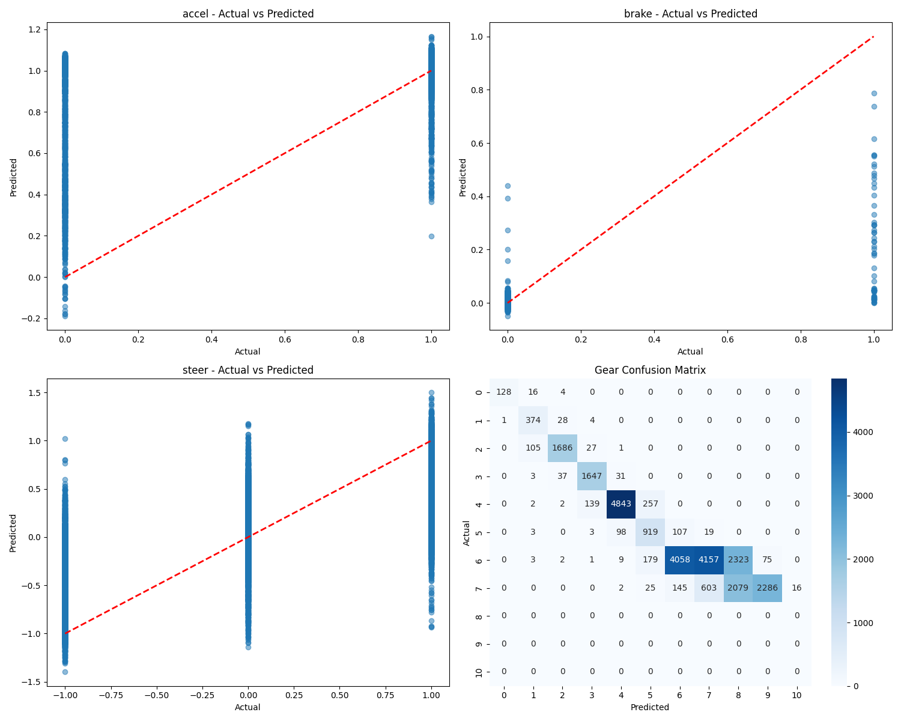

# Model Evaluation Report (Sigma)

Generated on: 2025-05-29 12:39:09

## Feature Weights

| Feature | Weight |
|---------|--------|
| trackPos | 3.0 |
| speedX | 1.3 |
| distFromStart | 0.8 |
| z | 0.7 |

## Model Architecture

| Parameter | Value |
|-----------|-------|
| hidden_layer_sizes | (180, 180, 60, 30) |
| activation | relu |
| solver | adam |
| max_iter | 100 |
| n_layers | 6 |
| n_features | 73 |
| n_outputs | 5 |
| n_iterations | 57 |
| loss | 0.008422669103473595 |
| best_loss | 0.008329103454400315 |

## Dataset Information

Number of test samples: 26447

## Regression Metrics

### accel

| Metric | Value |
|--------|-------|
| MAE | 0.0860 |
| RMSE | 0.2169 |
| R2 | 0.2385 |
| Mean Actual | 0.9338 |
| Mean Predicted | 1.0113 |
| Std Actual | 0.2486 |
| Std Predicted | 0.1120 |
| Min Actual | 0.0000 |
| Max Actual | 1.0000 |
| Min Predicted | -0.1885 |
| Max Predicted | 1.1657 |

### brake

| Metric | Value |
|--------|-------|
| MAE | 0.0052 |
| RMSE | 0.0410 |
| R2 | 0.3027 |
| Mean Actual | 0.0024 |
| Mean Predicted | 0.0010 |
| Std Actual | 0.0491 |
| Std Predicted | 0.0159 |
| Min Actual | 0.0000 |
| Max Actual | 1.0000 |
| Min Predicted | -0.0490 |
| Max Predicted | 0.7872 |

### steer

| Metric | Value |
|--------|-------|
| MAE | 0.2239 |
| RMSE | 0.3650 |
| R2 | 0.4408 |
| Mean Actual | 0.0607 |
| Mean Predicted | 0.0399 |
| Std Actual | 0.4882 |
| Std Predicted | 0.3543 |
| Min Actual | -1.0000 |
| Max Actual | 1.0000 |
| Min Predicted | -1.3986 |
| Max Predicted | 1.5005 |

### gear

| Metric | Value |
|--------|-------|
| Accuracy | 0.5391 |
| F1 | 0.6054 |
| Most Common Gear Predicted | 3.0000 |

### safety

| Metric | Value |
|--------|-------|
| Percentage Invalid Accel | 87.7642 |
| Percentage Invalid Brake | 54.1801 |
| Percentage Invalid Steer | 2.7262 |

## Gear Classification Metrics

| Metric | Value |
|--------|-------|
| Accuracy | 0.5391 |
| F1 | 0.6054 |
| Most Common Gear Predicted | 3.0000 |

### Gear Distribution

| Gear | Actual Count | Predicted Count |
|------|--------------|-----------------|
| -1 | 148 | 129 |
| 0 | 407 | 506 |
| 1 | 1819 | 1759 |
| 2 | 1718 | 1821 |
| 3 | 5243 | 4984 |
| 4 | 1149 | 1380 |
| 5 | 10807 | 4310 |
| 6 | 5156 | 4779 |
| 7 | 0 | 4402 |
| 8 | 0 | 2361 |
| 9 | 0 | 16 |

## Safety Checks

| Check | Count | Percentage |
|-------|-------|------------|
| Invalid Accel | 23211 | 87.76% |
| Invalid Brake | 14329 | 54.18% |
| Invalid Steer | 721 | 2.73% |

## Prediction Plots

